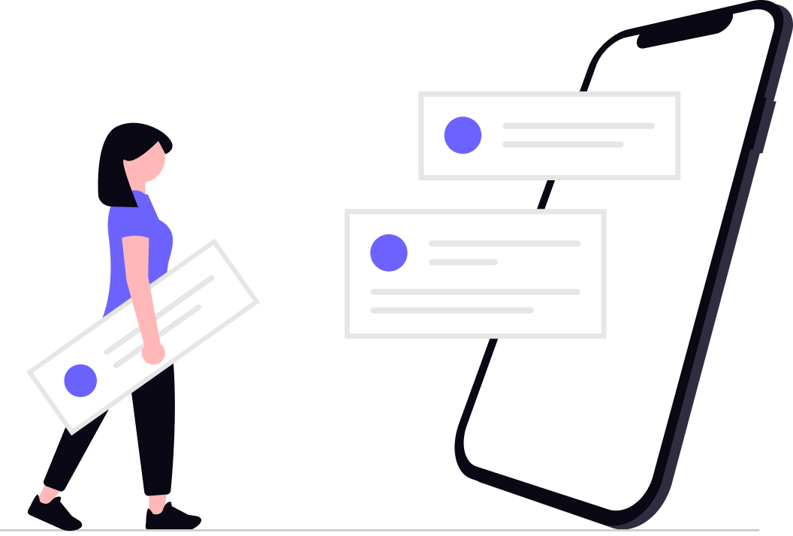

<div align="center">

  

  # Tasky — Modern Task & Productivity Manager

  **A sleek, responsive, and intuitive task management application built with Flutter & Firebase.**  
  *Organize your day, prioritize what matters, and build productive habits effortlessly.*

  <p align="center">
    <a href="https://flutter.dev">
      
    </a>
    <a href="https://dart.dev">
      
    </a>
    <a href="https://firebase.google.com">
      
    </a>
    
    
  </p>

  <p align="center">
    <a href="#-key-features">Key Features</a> •
    <a href="#-app-preview--screenshots">App Preview</a> •
    <a href="#-architecture--structure">Architecture</a> •
    <a href="#-firestore-database-schema">Database Schema</a> •
    <a href="#-tech-stack--dependencies">Tech Stack</a> •
    <a href="#-getting-started">Getting Started</a> •
    <a href="#-contributing">Contributing</a>
  </p>
</div>

---

## 📖 About Tasky

**Tasky** is a mobile task management application designed to simplify daily planning and routine tracking. Built with **Flutter** and powered by **Google Firebase**, Tasky provides real-time task synchronization, secure authentication, priority-based workflows, and push notifications through an elegant and distraction-free UI.

Whether you are tracking personal goals, managing work assignments, or scheduling daily routines, Tasky delivers a smooth experience with zero clutter.

---

## ✨ Key Features

### 🔐 Secure Authentication & User Management
- **Email & Password Authentication**: Full registration and login flows backed by Firebase Auth.
- **Strong Form Validation**: Strict client-side validation for emails, strong passwords, and usernames.
- **Persistent Sessions**: Automated session checking on launch (`FirebaseAuth.instance.currentUser`) to direct authenticated users straight to their dashboard.
- **Secure Sign Out**: One-tap session termination with safe route replacement.

### 📅 Interactive Timeline & Daily Calendar
- **Horizontal Date Timeline**: Seamless horizontal date-picker strip (`date_picker_timeline`) for quick navigation across dates.
- **Day-Filtered Task Queries**: Automatically query and view tasks specifically scheduled for the selected calendar date.

### 📝 Complete Task Lifecycle (CRUD)
- **Create Task**: Add new tasks with title, description, custom scheduled date, and priority rating via an interactive bottom sheet.
- **View Tasks**: Real-time list view with task title, scheduled date, priority badge, and completion state.
- **Edit & Update**: Modify task title, description, scheduled date (via native date picker), or priority level at any time.
- **Completion Toggle**: Quickly check off tasks with interactive circular checkboxes.
- **Delete Task**: Permanently remove unwanted tasks with instant Firestore synchronization.

### 🎯 10-Level Priority System
- **Custom Priority Matrix**: Assign task importance from level `1` (lowest) to `10` (highest).
- **Interactive Selector**: Visual modal selector (`PriorityDialog`) with instant selection feedback.
- **Visual Priority Badges**: Priority tags displayed directly on every task card for immediate clarity.

### 🔔 Push Notifications (FCM)
- **Firebase Cloud Messaging**: Integrated push notification handling.
- **Foreground Alert Dialogs**: Custom pop-up alerts displayed when notifications arrive while using the app.
- **Background & Terminated Handlers**: Robust background messaging support with direct navigation on notification interaction.
- **Permission Management**: Automated system-level notification permissions request.

### 🎨 Clean UI & Brand Experience
- **Custom Native Splash**: Tailored splash screens on Android 12+ and iOS (`flutter_native_splash`).
- **Interactive Onboarding**: 3-step carousel with `smooth_page_indicator` introducing core app capabilities.
- **Empty States**: Engaging illustrations when no tasks are scheduled for the selected day.

---

## 📱 App Preview & Visuals

<div align="center">
  <table>
    <tr>
      <td align="center" width="33%">
        <br/>
        <b>Manage Your Tasks</b><br/>
        <i>Effortlessly keep track of daily responsibilities</i>
      </td>
      <td align="center" width="33%">
        <br/>
        <b>Create Daily Routines</b><br/>
        <i>Build productive habits and stay on schedule</i>
      </td>
      <td align="center" width="33%">
        <br/>
        <b>Prioritize & Plan</b><br/>
        <i>Structure work with granular 10-point priority</i>
      </td>
    </tr>
    <tr>
      <td colspan="3" align="center">
        <br/>
        <b>Clean Dashboard Experience</b><br/>
        <i>Friendly empty states and distraction-free workspace</i>
      </td>
    </tr>
  </table>
</div>

---

## 🏛 Architecture & Structure

Tasky follows a modular, feature-first layered architecture ensuring separation of concerns, testability, and clean code principles.

```
Tasky-App/
├── android/                   # Android native platform configuration & Gradle scripts
├── ios/                       # iOS native platform configuration & CocoaPods
├── assets/
│   ├── icons/                 # App icons, action buttons, priority icons & illustrations
│   └── images/                # Splash screens for Android 11, Android 12+ & iOS
├── lib/
│   ├── models/                # Data models with JSON & Firestore converters
│   │   ├── task_model.dart    # Task entity (id, title, description, date, priority, isCompleted)
│   │   └── user_model.dart    # User entity (id, name, email, password)
│   ├── views/
│   │   ├── pages/             # App screen widgets
│   │   │   ├── onboarding_page.dart # 3-step introductory walkthrough
│   │   │   ├── login_page.dart      # Email/password authentication
│   │   │   ├── register_page.dart   # New user registration & validation
│   │   │   ├── home_page.dart       # Main dashboard with timeline & task list
│   │   │   └── edit_task_page.dart  # Task details modification & deletion
│   │   └── widgets/           # Reusable UI widgets & business services
│   │       ├── app_assets.dart             # Centralized asset path constants
│   │       ├── app_dialog_widget.dart      # Loading indicators & error alert dialogs
│   │       ├── app_routes.dart             # Named route definitions
│   │       ├── firebase_authentication.dart# Auth service (signIn, register, session)
│   │       ├── firebase_result.dart        # Sealed Result pattern (Success / Error)
│   │       ├── firebase_task.dart          # Firestore Task service (CRUD operations)
│   │       ├── item_card_widget.dart       # Task list tile with priority & checkmark
│   │       ├── modal_bottom_sheet.dart     # New task creation bottom sheet
│   │       ├── priority_dialog.dart        # 1-10 priority selection dialog
│   │       ├── priority_item_widget.dart   # Individual priority badge widget
│   │       ├── text_form_field_widget.dart # Styled form inputs with validation
│   │       └── validator.dart              # Regex validators (email, password, name)
│   ├── firebase_options.dart  # Platform Firebase configuration (auto-generated)
│   └── main.dart              # App entrypoint, FCM handlers & route registration
├── pubspec.yaml               # Project dependencies and asset declarations
└── flutter_native_splash.yaml # Splash screen branding configuration
```

### 🛡 The Result Pattern (`FirebaseResult<T>`)
Network and database operations utilize a typed result wrapper pattern to eliminate uncaught exceptions and provide clear UI handling:

```dart
sealed class FirebaseResult<T> {}

class FirebaseSuccess<T> extends FirebaseResult<T> {
  final T? data;
  FirebaseSuccess(this.data);
}

class FirebaseError<T> extends FirebaseResult<T> {
  final String message;
  FirebaseError(this.message);
}
```

---

## 🗄 Firestore Database Schema

User data is strictly isolated using **per-user subcollections** in Cloud Firestore. This ensures multi-tenant security and straightforward Firestore security rules.

```
users (Collection)
 └── {userId} (Document)
      ├── id: String
      ├── name: String
      ├── email: String
      └── tasks (Subcollection)
           └── {taskId} (Document)
                ├── id: String
                ├── title: String
                ├── description: String
                ├── date: Number (Epoch Milliseconds)
                ├── priority: Number (1-10)
                └── isCompleted: Boolean
```

---

## 🛠 Tech Stack & Dependencies

| Category | Technology | Purpose |
| :--- | :--- | :--- |
| **Framework** | [Flutter](https://flutter.dev) (Dart SDK `^3.9.2`) | Cross-platform UI toolkit |
| **Authentication** | [`firebase_auth`](https://pub.dev/packages/firebase_auth) | User registration, authentication & token handling |
| **Database** | [`cloud_firestore`](https://pub.dev/packages/cloud_firestore) | Real-time NoSQL cloud database with typed converters |
| **Push Notifications**| [`firebase_messaging`](https://pub.dev/packages/firebase_messaging) | FCM foreground, background, and app-open notifications |
| **Crash Reporting** | [`firebase_crashlytics`](https://pub.dev/packages/firebase_crashlytics) | Real-time crash diagnostics |
| **Calendar Widget** | [`date_picker_timeline`](https://pub.dev/packages/date_picker_timeline) | Interactive horizontal date-picker strip |
| **Page Indicator** | [`smooth_page_indicator`](https://pub.dev/packages/smooth_page_indicator) | Animated carousel indicators for onboarding |
| **Animations** | [`animate_do`](https://pub.dev/packages/animate_do) | Smooth UI element transitions and effects |
| **Splash Screen** | [`flutter_native_splash`](https://pub.dev/packages/flutter_native_splash) | Branded native launch screen generation |

---

## 🚀 Getting Started

Follow these steps to set up and run the project locally on your machine.

### Prerequisites

- [Flutter SDK](https://docs.flutter.dev/get-started/install) (`>= 3.0.0`)
- [Dart SDK](https://dart.dev/get-dart) (`^3.9.2`)
- [Android Studio](https://developer.android.com/studio) or [VS Code](https://code.visualstudio.com/) with Flutter extensions
- Android Emulator, iOS Simulator, or a physical mobile device
- A [Firebase](https://firebase.google.com/) account and the [Firebase CLI](https://firebase.google.com/docs/cli)

### 1. Clone the Repository

```bash
git clone https://github.com/Ahmed-Moataz-glitch/Tasky-App.git
cd Tasky-App
```

### 2. Install Dependencies

```bash
flutter pub get
```

### 3. Firebase Setup

1. Install the FlutterFire CLI (if not already installed):
   ```bash
   dart pub global activate flutterfire_cli
   ```

2. Configure Firebase for your project:
   ```bash
   flutterfire configure
   ```
   Select your Firebase project and enable **Android** and **iOS**. This updates `lib/firebase_options.dart`.

3. In the [Firebase Console](https://console.firebase.google.com/):
   - Enable **Authentication** (Email/Password sign-in provider).
   - Create a **Cloud Firestore Database** (start in Test mode or configure security rules).
   - Enable **Cloud Messaging** for push notifications.

### 4. Run the Application

```bash
# Run on connected device or active emulator
flutter run

# Run in profile or release mode
flutter run --release
```

### 5. Build for Production

```bash
# Android APK
flutter build apk --split-per-abi

# Android App Bundle (for Play Store)
flutter build appbundle

# iOS (requires macOS and Xcode)
flutter build ipa
```

---

## 🔒 Form Validation Rules

Tasky includes rigorous client-side input validation located in [`lib/views/widgets/validator.dart`](lib/views/widgets/validator.dart):

- **Email**: Strict RFC 5322 regex validation to prevent invalid addresses.
- **Password**: Requires minimum 6 characters including at least one uppercase letter and one digit.
- **Confirm Password**: Ensures password fields match before submission.
- **Name**: Non-empty validation for usernames and task titles.

---

## 🗺 Roadmap & Planned Enhancements

- [ ] 🌙 **Dark Mode Support**: Dynamic system theme switching.
- [ ] 🏷️ **Task Categories / Tags**: Organize tasks by Work, Personal, Fitness, Study, etc.
- [ ] 🔍 **Search & Filter**: Real-time search by keywords and filter by completion or priority.
- [ ] ⏰ **Scheduled Local Reminders**: Set alarms and specific time-of-day reminders for tasks.
- [ ] 📶 **Offline Persistence**: Offline Firestore cache with automatic cloud reconciliation.
- [ ] 📊 **Productivity Statistics**: Weekly and monthly completion charts and streaks.

---

## 🤝 Contributing

Contributions, issues, and feature requests are welcome!

1. **Fork the Repository**
2. **Create a Feature Branch** (`git checkout -b feature/AmazingFeature`)
3. **Commit your Changes** (`git commit -m 'feat: Add some AmazingFeature'`)
4. **Push to the Branch** (`git push origin feature/AmazingFeature`)
5. **Open a Pull Request**

---

## 📄 License

This project is licensed under the **MIT License** — see the [LICENSE](LICENSE) file for details.

---

## 👨‍💻 Author

**Ahmed Moataz**
- GitHub: [@Ahmed-Moataz-glitch](https://github.com/Ahmed-Moataz-glitch)
- Project Repository: [Tasky-App](https://github.com/Ahmed-Moataz-glitch/Tasky-App)

---

<div align="center">
  <sub>Built with ❤️ using Flutter & Firebase. If you find this project helpful, give it a ⭐!</sub>
</div>
